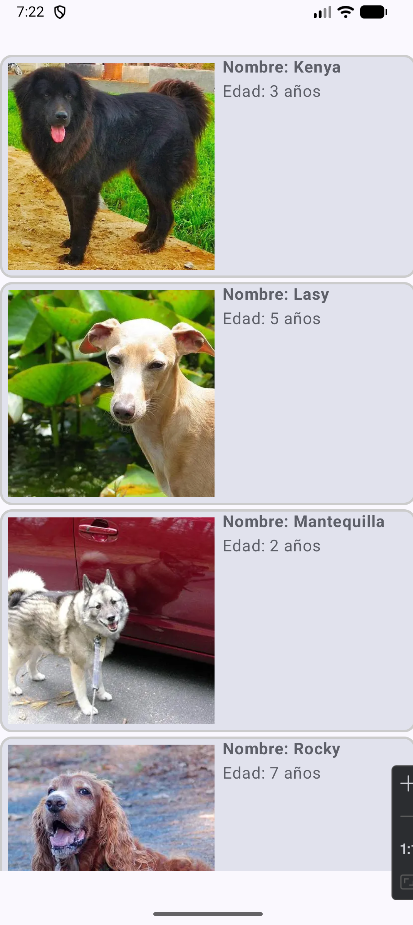

# PR06 - Lazy Components (Gossos App)

Aquest projecte és una aplicació Android desenvolupada amb **Jetpack Compose** per a l'assignatura de Desenvolupament d'interfícies (DAM2). L'objectiu principal és consolidar l'arquitectura MVVM i explorar l'ús de llistes eficients amb `LazyColumn`.

## 👥 Autors
* **Alumne 1:** Jordi Ros
* **Alumne 2:** Gerard Fornés

## 📝 Descripció
L'aplicació simula el consum d'una API REST pública (Dog API).
Mostra un llistat de gossos amb la seva imatge, nom i edat. Les dades s'han instanciat manualment per simular la resposta del servidor i es mostren utilitzant components "Lazy" per optimitzar el rendiment.

## 📱 Captures de pantalla
Aquí es mostra el resultat final de la llista de gossos implementada:

## 🚀 Funcionalitats implementades
Seguint els requisits de la pràctica PR06:

* **Arquitectura MVVM:** Separació de la lògica de negoci i la interfície d'usuari.
* **Lazy Components:** Ús de `LazyColumn` per renderitzar la llista d'elements de manera eficient.
* **Disseny Personalitzat:** Cada element de la llista utilitza `Card`, `Row` i `Column` per mostrar la informació del gos (Model `Dog`).
* **Dades Simulades:** Instanciació manual de 8 elements (Kenya, Lasy, Mantequilla, etc.) basats en l'API de gossos.

## 🛠️ Estructura del Projecte
* **Model:** `Dog.kt` - Data class que representa l'objecte (nom, edat, imatge).
* **ViewModel:** `LazyComponentsViewModel.kt` - Gestiona la llista de dades (`getDogsList`).
* **View:** `MainView.kt` - Conté la interfície d'usuari amb el `LazyColumn`.

## 📚 Referències
* Assignatura: DAM2 0488
* API Inspiració: [Dog API](https://dog.ceo/dog-api/)
